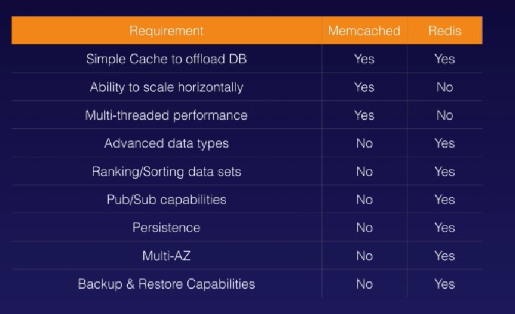

# Notes on Amazon Data Warehouse - Redshift

## Redshift

Amazon Redshift is a fast and powerful, fully managed petabyte-scale data warehouse service in the cloud. 

Customers can start with small for just $0.25 per hour with no commitments or upfront costs and scale to a petabyte or more for $1,000 per terabyte per year, less than 1/10 of most data warehousing solutions.

### Configuration

- Single Node (with 160GB storage)
- Multi-Node
  - Leader Node _(manages client connections and receives queries)_
  - Compute Node _(store data and perform queries and computations)_ - Up to 128 Compute Nodes

### Columns

**Columnar Data Storage** - Instead of storing data as rows, Redshift organizes the data by column.

Unlike row-based systems, which are ideal for transaction processing, column-based systems are ideal for data warehousing and analytics, where queries often invovle aggregates performed over large data sets.

Since only the columns involved in the queries are processing and columnar data is stored sequentially on the storage media, column-based systems require far fewer I/Os, greatly improving query performance.

### Compression

**Advanced Compression** - Columnar data storescan be compressed much more than row-based data stores because similar data is stored sequentially on disk.

Redshift employs multiple compression techniques and can often achieve significant compression relative to traditional relational data stores. In addition, Redshift doesn't require indexes or materialized views and so uses less space than traditional relational database systems.

When loading data into an empty table, Redshift automatically samples you data and selects the most appropriate compression scheme.

### MPP

**Massive Parallel Processing (MPP)** - Redshift automatically distributes data and query load across all nodes. Redshift makes it easy to add nodes to your data warehouse and enables you to maintain fast query performance as your data warehouse grows.

### Pricing

**How is Redshift priced?**

- Compute Node Hours
  - Total number of hours you run across all your compute nodes for the billing period
  - Billed for 1 unit per node per hour, so a 3 - node data warehouse cluster running persistently for an entire month would incur 2,160 instance hours.
  - You will **not** be charged for leader node hours; only compute nodes will incur charges

- Backups
- Data transfers (Only within a VPC, not outside of it)

### Security

- Encrypted in transit using SSL
- Encrypted at rest using AES-256 encryption
- By default Redshift takes care of key management
  - But you can manages your keys through HSM (Hardware Security Module) or
  - AWS Key Management Service (KMS)

### Availability

- Currently only available in 1 AZ - Realistically only for business intelligence and analytical purpose
- Can restore snapshots to new AZ's in the event of outage.

# Notes on Elasticache
ElastiCache is a web service that makes it easy to deploy, operate and scale an in-memory cache in the cloud. The service improves the performance of web applications by allowing you to retrieve information from fast, mananged, in-memory caches, instead of relying entirely on slower disk-based databases.

### Why ElastiCache?

ElastiCache can be used to significantly improve latency and throughput for many read-heavy application workloads - ie networking, gaming, media sharing and Q&A portals or compute intensive workloads.

Caching improves application performance by storing critical pieces of data in memory for low-latency access. Cached information may include the results of I/O intensive database queries or the results of computational intensive calculations

ElastiCache supports Master/Slave replcation and Multi-AZ which can be used to achieve cross AZ redundancy.

### Types of Elasticache

- Memcached
  - A widely adopted memory object caching system. Elasticache is protocol compliant with Memcached, so popular tools that you use today with existing Memcached environments will work seamlessly with the service.

- Redis
  - A popular open-source in-memory key-value store that supports data structures such as sorted sets and lists. 

### Memcache Vs Redis

# Exam Tips - Redshift
- Backup enabled by default with 1 day retention period
- Maximum retention period is 35 days
- Always attempt to maintain at least 3 copies of your data (The original one, replica on the compute node and the backup in S3)
- Can also aynchronously replicate your snapshots to S3 in another region for disaster recovery

# Exam Tips - Elasticache

