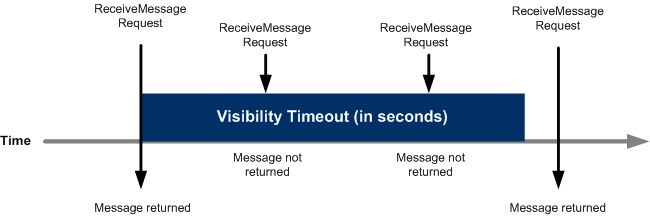

# Simple Queue Service (SQS)
## Amazon's first AWS service

Amazon Simple Queue Service (SQS) is a fast, reliable, scalable and fully managed message queuing service that enables you to decouple and scale microservices, distributed systems, and serverless applications. Amazon SQS makes it easy.

It's a pull based system.
256KB is the max size of message of any form. Messages can be kept in the queue from 1 minute to 14 days. Default is 4 days.

SQS offers two types of message queues:
- Standard Queue
  - Offer maximum throughput, 
  - best-effort ordering, 
  - at-least-once delivery.
- FIFO Queue
  - designed to guarantee that messages are processed exactly once.
  - Gurrantee orderting as they sent

## Standard Queue
__Unlimited Throughput:__ Standard queues support a nearly unlimited number of transactions per second (TPS) per API action.

__At-Least-Once Delivery:__ A message is delivered at least once, but occasionally more than one copy of a message is delivered. Design your applications to be __*idempotent*__ (they should not be affected adversely when processing the same message more than once).

__Best-Effort Ordering:__ Occasionally, messages might be delivered in an order different from which they were sent.

Send data between applications when the throughput is important, for example:
  - Decouple live user requests from intensive background work: let users upload media while resizing or encoding it.
  - Allocate tasks to multiple worker nodes: process a high number of credit card validation requests.
  - Batch messages for future processing: schedule multiple entries to be added to a database.

  ## FIFO Queue
  __High Throughput:__ FIFO queues support up to 300 messages per second (300 send, receive, or delete operations per second). When you batch 10 messages per operation (maximum), FIFO queues can support up to 3,000 messages per second. To request a limit increase, file a support request.

  __First-ln-First-out Delivery:__ The order in which messages are sent and received is strictly preserved.

  __Exactly-Once Processing:__ A message is delivered once and remains available until a consumer processes and deletes it. Duplicates are not introduced into the queue.

  

  Send data between applications when the order of events is important, for example:
   - Ensure that user-entered commands are executed in the right order.
   - Display the correct product price by sending price modifications in the right order.
   - Prevent a student from enrolling in a course before registering for an account.

## Delay Queues
Delay queues allow you to postpone the delivery of new messages in a queue for a specific
number of seconds. If you create a delay queue, any message that you send to that queue will
be invisible to consumers for the duration of the delay period.

## Visibility Timeout
When a consumer receives and processes a message from a queue, the message remains in the queue. Amazon SQS doesn't automatically delete the message. Because Amazon SQS is a distributed system, there's no guarantee that the consumer actually receives the message (for example, due to a connectivity issue, or due to an issue in the consumer application). Thus, the consumer must delete the message from the queue after receiving and processing it.

- To prevent other consumers from processing the message again, Amazon SQS sets a __*visibility timeout*__, a period of time during which Amazon SQS prevents other consumers from receiving and processing the message.
- The default visibility timeout for a message is 30 seconds. The minimum is 0 seconds. The maximum is 12 hours.

### Delay Queue vs Visibility Timeout
- Delay queues are similar to visibility timeouts in that both features make messagesm unavailable to consumers for a specific period of time. 
- The difference is that a delay queue hides a message when it is first added to the queue, whereas a visibility timeout hides a message only after that message is retrieved from the queue.

### SQS Long polling
Long polling helps reduce the cost of using Amazon SQS by eliminating the number of empty responses (when there are no messages available for a ReceiveMessage request) and false empty responses (when messages are available but aren't included in a response).

Benefites:
- Eliminate empty responses by allowing Amazon SQS to wait until a message is available in a queue before sending a response. Unless the connection times out, the response to the ReceiveMessage request contains at least one of the available messages, up to the maximum number of messages specified in the ReceiveMessage action.
- Eliminate false empty responses by querying all—rather than a subset of—Amazon SQS servers.
- Return messages as soon as they become available.

### SQS Short polling

- Default polling used by Amazon SQS
- Query only a subset of its servers (based on a weighted random distribution), to determine whether any messages are available for a response.

### Scenario
Q) You run a website which hosts videos and you have two types of members, premium fee paying members and free members. All videos uploaded by both your premium members and free members are processed by a fleet of EC2 instances which will poll SQS as videos are uploaded. However you need to ensure that your premium fee paying members videos have a higher priority than your free members. How do you design SQS?

Ans:
SQS allows you to set priorities on individual items within the queue, so simply set the fee paying members at a higher priority than your free members.

Create 2 SQS one for premium and another for free members. EC2 should poll premium one first and only if it is empty the free ones.