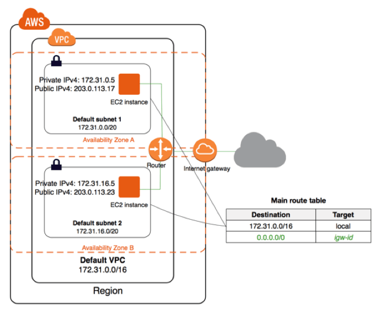
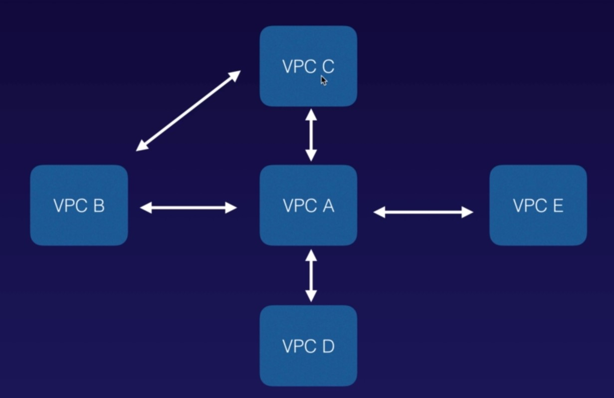
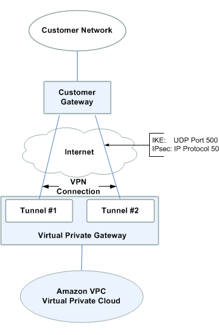
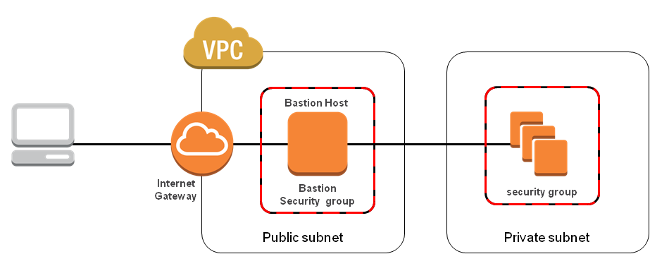

# AWS Virtual Private Cloud (VPC)
### __Amazon's definition of VPC:__

*Amazon Virtual Private Cloud (VPC) enables you to launch AWS resources into a virtual network that you define. This virtual network closely resembles traditional network that you'd operate in your own data center, with the benefit of using scalable infrastructure of AWS.*

- Logically isolated virtual IP networking for AWS resources like EC2, RDS instances
- AWS root account can have many VPCs (soft limit is 5 per region)
- AWS root account created after Dec. 4 2013 supports VPCs and comes with a default VPC per region
- Each VPC is divided into *subnets* each bound to a AZ
- However, AZ can host multiple subnets
- Each instance launched connects to a subnet with a Elastic Network Interface (ENI)

### VPC capability
- Isolate AWS resources from other account
- Routing network traffic to and from your instances
- Protecting your instances from network intrusion

## Benefits of VPC
- Ability to launch instance in a subnet
- Ability define custom IP address ranges inside each subnets
- Ability configure route table between subnets
- Ability to configure Internet gateway and attach it to subnets 
- Ability to create layered network of resources
- More fine grain security settings to protect cloud assets
- Extend you existing data center to cloud with IPsec VPN connection
- Layered security
  - Security group at instance level
  - Network ACL at subnet level

## Default VPC
- Designed to make it easy for AWS users to setup networking for resources without having to create it from scratch
- Associated with an IPv4 CIDR block 172.31.0.0/16 address range which gives 65,536 IP addresses minus some AWS reserved addressed
- Default subnets are created with /20 CIDR block address range which gives 4091 minus 5 AWS reserved IP address 
- All subnets inside default VPC are associated with default Internet gateway (IGW)
- Each instance launched in default VPC receives a private IP address from the pool of address of the subnet and private DNS hostname
- Each instance launched in default VPC also receives a public IP from the pool of addresses owned by AWS and public DNS hostname which facilitate internet access to the instance
- You can delete default VPC, but try not to do so. You'd need to contact AWS support to restore it if it's deleted.

- Default VPC is okay for testing AWS resources, training and low-critical single tier application.
- It's recomended not to use default VPC for production workload.
  - default VPC lacks proper security and auditing controls
  - Doesn't enable VPC-Flowlog - controls allows admin to track network flow in the VPC for auditing and troubleshooting purposes. There are third-party tools in AWS ecosystem for analyzing these logs
  - Unrestricted NACLs
  - No tagging - using tags and closely related resource groups simplifies the management of resources in VPC and helps analyzing costs.
  

> CIDR (Classless Inter Domain Routing) IP address range defines a range of IP addresses which AWS will use to assign *__private__* IP address to EC2 instances.

### Private Address Space (RFC 1918)
The Internet Assigned Numbers Authority (IANA) has reserved following 3 blocks of IP address space for private internets.

- 10.0.0.0        -   10.255.255.255  (10/8 prefix)
- 172.16.0.0      -   172.31.255.255  (172.16/12 prefix)
- 192.168.0.0     -   192.168.255.255 (192.168/16 prefix)

AWS recomends that VPC to use this private address space, however, AWS VPC supports /28 CIDR blocks to /16 CIDR block of IP address.

## VPC Peering
- Allows to connect one VPC to another using direct network route with private IP address
- Instances behave as if they are on same private network
- Peering is possible with VPCs on other AWS account as well as VPCs on the same account.
- Peering support STAR configuration. NO TRANSITIVE PEERING POSSIBLE

## VPC Components
There are couple of core components which are fundamental to VPC as follows:
- VPC CIDR Block
- Subnet
- Route table
- Internet Gateway
- NAT Gateway/NAT Instance
- Virtual Private Gateway
- Network Access Control List (NACL)
- Security Group
- Peering Connection
- VPC Endpoint
- Egress-Only Internet Gateway

__VPC CIDR Block:__ CIDR (Classless Inter Domain Routing) IP address range defines a range of IP addresses which AWS will use to assign *__private__* IP address to EC2 instances.

__Subnet:__ A segnet of a VPC's IP address range where you can place group of isolated resources.

__Route Table:__ A table of defined routes which routes the traffic to and from subnets.

__Internet Gateway:__ The Amazon VPC side of a connection to the public Internet.

__NAT Gateway/NAT Instance:__ A NAT Gateway is highly available, managed Network Address Translation service for your resources in private subnets to access the Internet. However, NAT instance is not managed and needs to be provisioned and high availabilty to be guranteed by user. AWS recomends to use NAT gateway as NAT instance is phasing out soon. NAT gateway supports only IPv4 traffic and doesn't support IPv6 traffic.

__Virtual Private Gateway:__ The Amazon VPC side of a VPN connection. Following are components of VPN connections:
  - __Customer gateway:__ An Amazon VPC VPN connection links your data center (or network) to your Amazon VPC virtual private cloud (VPC). A customer gateway is the anchor on your side of that connection. It can be a physical or software appliance. 
  - __Virtual private gateway:__ The anchor on the AWS side of the VPN connection is called a virtual private gateway.

  

__NACL:__ Network Access Control List acts as a firewall to subnet level. It is stateless meaning inbout as well as outboud access rule has to be defined explicitly.

__Security Group:__ Acts as a firewall to instance level. It's stateful meaning inbound rule will be membered for traffic out.

__Peering Connection:__ A peering conection enables you to route traffic via private IP address between two peered VPCs

__VPC Endpoint:__ Enables private connectivity to services hosted in AWS, from within your VPC without using an Internet Gateway, VPN, NAT devices or firewall

__Egress-only Internet Gateway:__ A sateful gateway to provide egress only access for IPv6 traffic from the VPC to the Internet. An egress-only Internet gateway is a horizontally scaled, redundant, and highly available VPC component that allows outbound communication over IPv6 from instances in your VPC to the Internet, and prevents the Internet from initiating an IPv6 connection with your instances. IPv6 addresses are globally unique, and are therefore public by default.

## Custom VPC
When we create a new custom VPC, following components are created by default:
- A route table (called main route table)
- A default NACL
- A default Security group (Security group can't span across VPC but can span across AZ)

No subnets or IGW is created that we need to create by yourself.

When we create subnets in our custom VPC, 
- Auto assign IPv4/IPv6 IP address is diabled
- First 4 and last IP of the range is reserved by AWS

# Network Address Translation (NAT)

## NAT Instance
- You need to choose a NAT AMI from community tab to create NAT instance
- When create a NAT instance, disable Source/Destination check on the EC2 instance (Enabled by default)
- Must be in public subnet
- There must be a route out of the private subnet (route table attached to private subnet) to the NAT, in order for this to work.
- The amount of traffic a NAT instance can support depends on the instance type. If there is bottleneck, try increase the instance size/type.
- You can create high availability using Auto Scaling Groups, multiple subnets in different AZs and a script to automate failover.
- Always sits behind a security group

## NAT Gateway
- Redundant inside the AZ. It can't span across AZs
- Preferred by enterprise and recomended by AWS as well
- Starts with 5 gbps and scales automatically upto 45 gbps. If you require more, you can distribute the workload by splitting your resources into multiple subnets, and creating a NAT gateway in each subnet.
- No need to patch
- Not associated with security group
- Associated with an Elastic IP address while creating it
- Update the route table of the private subnet with a route out to NAT gateway
- Must be in public subnet
- No need to disable Source/Destination Check
- More Secure than NAT Instance.
- NAT gateways are not supported for IPv6 traffic. You use an egress-only internet gateway instead.
- A NAT gateway supports the following protocols: TCP, UDP, and ICMP.
- If you have resources in multiple AZs, and they share one NAT gateway, in the event that NAT gateway's AZ is down, resources in other AZ loose Internet access. To create an AZ-independent architecture, create a NAT gateway in each AZs and configure your routing to ensure that resources use the NAT gateway in the same AZ.

## VPC Flow Logs
---
VPC Flow Logs is a feature that enables you to capture info about the IP traffic going to and from network interfaces in your VPC. Flow log data is stored using Amazon Cloudwatch Logs.

After you've created a flow log, you can view and retrieve its data in Amazon CloudWatch Logs.

Flow logs can be create at 3 levels:

- VPC
- Subnet
- Network Interface Level

### __Exam Tips__
- You cannot enable flow logs for VPCs that are peered with your VPC unless the peer VPC is in your account.
- Cannot tag a flow log
- After you've created a flow log, you cannot change its configuration; for example, you cant associate a different IAM role with the flow log

__Not all IP traffic is monitored__

- Traffic generated by instances when they contact the Amazon DNS server. If you use your own DNS server, then all traffic to the DNS server is logged.
- Traffic generated by a Windows instance for Amazon Windows license activation.
- Traffic to and from 169.254.169.254 for instance metadata
- DHCP traffic
- Traffic to the reserved IP address for the default VPC router

## VPC Endpoint
---
A VPC endpoint enables you to privately connect your VPC to supported AWS services and VPC endpoint services powered by PrivateLink without requiring an internet gateway, NAT device, VPN connection, or AWS Direct Connect connection.

- Instances in your VPC do not require public IP addresses to communicate with resources in the service. 
- Traffic between your VPC and the other service does not leave the Amazon network.
- Endpoints are virtual devices. They are horizontally scaled, redundant, and highly available VPC components that allow communication between instances in your VPC and services without imposing availability risks or bandwidth constraints on your network traffic.

__There are two types of VPC endpoints:__
- __Interface endpoints:__ An interface endpoint is an elastic network interface with a private IP address that serves as an entry point for traffic destined to a supported service.

  There are many supported services:
    - Amazon API Gateway
    - Amazon Cloudtrail
    - Amazon Cloudwatch
    - many more

- __Gateway endpoints:__ A gateway endpoint is a gateway that is a target for a specified route in your route table, used for traffic destined to a supported AWS service. 

  The following AWS services are supported:
    - Amazon S3
    - Amazon DynamoDB
    

## Bastion Host (aka Jump server)
- A bastion host is a server whose purpose is to provide access to a private network from an external network, such as Internet. 
- It typically sit within your public subnet and are typically accessed using SSH or RDP. 
- Once remote connectivity has been established with the bastion host, it then acts as a "jump" server, allowing you to use SSH or RDP to log in to other instances (within private subnets) deeper within your VPC. 
- When properly configured through the use of security groups and Network ACLs (NACLs), the bastion essentially acts as a bridge to your private instances via the Internet.
- When designing the bastion host for your AWS infrastructure, you shouldn’t use it for any other purpose, as this could open unnecessary security holes.

### Basic steps for creating a bastion host for your AWS infrastructure:
- Bastion host AMI available in AWS AMI community.
- Or using following steps:
  1. Launch an EC2 instance as you normally would for any other instance.
  2. Apply OS hardening as required. Like disabling unnecessary applications or services, tuning the network stack, and the like.
  3. Set up the appropriate security groups (SG).
  4. Implement either SSH-agent forwarding (Linux connectivity) or Remote Desktop Gateway (Windows connectivity).
  5. Deploy an AWS bastion host in each of the Availability Zones you’re using.

- [Reference link](https://cloudacademy.com/blog/aws-bastion-host-nat-instances-vpc-peering-security/)

- [How to Record SSH Sessions Established Through a Bastion Host](https://aws.amazon.com/blogs/security/how-to-record-ssh-sessions-established-through-a-bastion-host/)

## NAT vs Bastion
- A NAT is used to provide internet traffic to EC2 instances in private subnets
- A Bastion is used to securely administer EC2 instances using SSH or RDP

